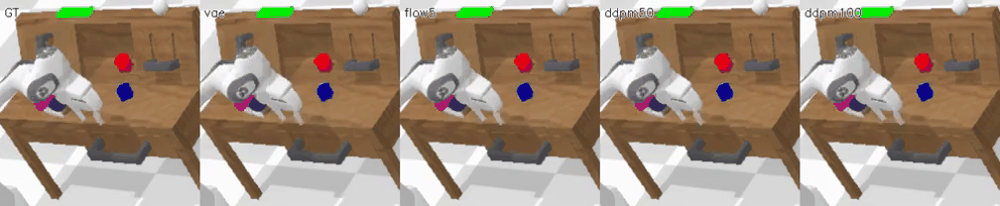
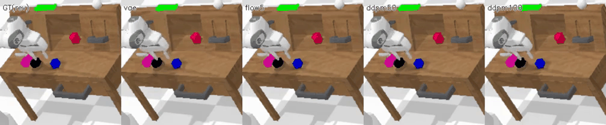
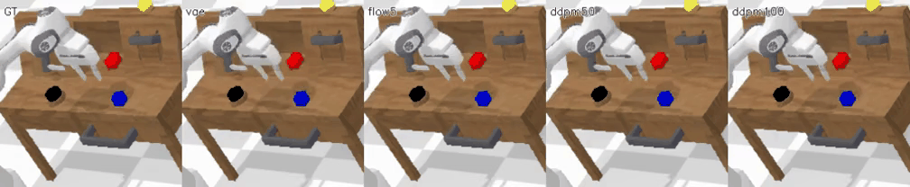
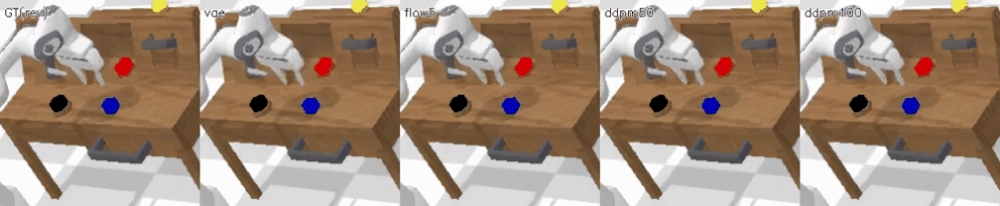
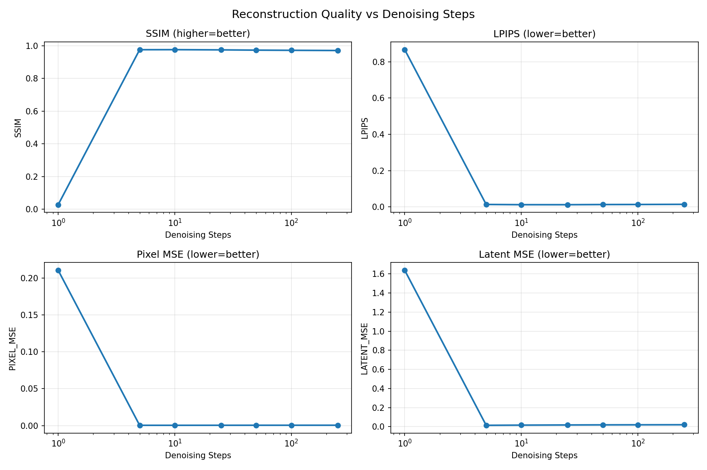
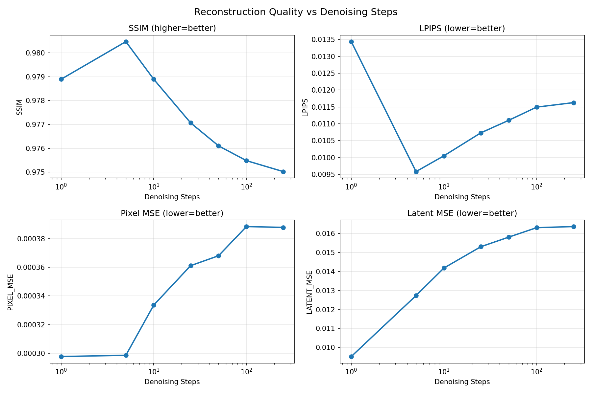

# DriftWorld

A world model framework for robot manipulation that predicts the next visual state given (current image, action). Compares four generative architectures — **VAE**, **DDPM**, **Flow Matching**, and **Drifting Models** — using a shared DiT backbone operating in SD-VAE latent space.

## Architecture

```
Image (256×256) → [Frozen SD-VAE Encoder] → z (4×32×32)
                                                │
                              ┌─────────────────┴─────────────────┐
                              │   World Model  f(z_t, a_t, r_t)   │
                              │                                    │
                              │   Shared DiT-S/2 backbone (~33M)   │
                              │   + AdaLN-Zero conditioning        │
                              │                                    │
                              │   Variants:                        │
                              │   • VAE        (1-step, blurry)    │
                              │   • DDPM       (50-step DDIM)      │
                              │   • Flow Match (5-step Euler)      │
                              │   • Drifting   (1-step, WIP)       │
                              └─────────────────┬─────────────────┘
                                                │
                                          ẑ_{t+1} + r̂_{t+1}
                                                │
                              [Frozen SD-VAE Decoder] → Image (256×256)
```

**Inputs**: current image latent `z_t`, 7D relative action `a_t`, 15D proprioception `r_t`
**Outputs**: predicted next image latent `ẑ_{t+1}`, predicted next proprioception `r̂_{t+1}`

## Results

### World Model Rollout Comparison (64-step autoregressive)

Given the first frame and a sequence of expert actions from `push_blue_block_left`, each world model autoregressively predicts the next 64 frames.

#### Forward trajectory (training set)

Columns: GT | CALVIN Sim | VAE | Flow(5) | DDPM(50)



#### Reversed trajectory (training set)



#### Forward trajectory (validation set — unseen data)

Columns: GT | VAE | Flow(5) | DDPM(50) | DDPM(100)



*DDPM collapses to noise on unseen data. Only VAE and Flow(5) survive 64-step autoregressive rollout.*

#### Reversed trajectory (validation set)



*Same pattern: DDPM collapses, VAE/Flow stable. Tests whether models learn reversible dynamics — actions are negated and applied in reverse order from the trajectory's last frame.*

### Key Findings

| Model | Training Set Rollout | Validation Set Rollout | Rollout Stability |
|-------|---------------------|----------------------|-------------------|
| **VAE** | Stable, blurry | Stable, blurry | Best stability, worst sharpness |
| **Flow(5)** | Stable, sharp | Stable, sharp | **Best overall** |
| **DDPM(50)** | Stable on training data | **Collapsed to noise** | Overfits, not suitable for rollouts |
| **Drifting** | Mode collapsed (WIP) | N/A | Not yet working |

### DDIM Denoising Step Sweep

Single-step reconstruction quality vs denoising steps (DDPM model). Fixed a critical `clip_sample` bug in the DDIM scheduler — SD-VAE latents range [-3.5, 3.2], not [-1, 1].



*After the fix, 5 steps produces SSIM 0.976 — nearly identical to 250 steps. But for autoregressive rollout, more denoising steps increases error accumulation.*

### Flow Matching Step Sweep (Autoregressive Rollout)



*Flow Matching at 5 Euler steps achieves the best rollout stability (avg SSIM 0.892). More steps actually decreases quality due to error accumulation.*

## Current Progress

### Completed
- [x] Project scaffolding with uv, Hydra configs, W&B logging
- [x] Data pipeline: CALVIN download, SD-VAE latent precomputation, DINOv2 feature precomputation
- [x] DiT-S/2 backbone with AdaLN-Zero conditioning (shared across all models)
- [x] World model training: VAE, DDPM, Flow Matching on task_D_D (200K steps each)
- [x] DDIM denoising step sweep with `clip_sample=False` fix
- [x] Flow Matching step sweep (1, 2, 5, 10, 15, 20, 50)
- [x] Autoregressive rollout comparison on training and validation sets
- [x] Reversed trajectory experiments
- [x] CALVIN simulator integration (PyBullet)
- [x] PPO policy training infrastructure (image-conditioned: CNN encoder on z_t + robot_obs)
- [x] Combined reward: latent cosine similarity + physical EE-to-object distance
- [x] Goal extraction from CALVIN task annotations

### In Progress
- [ ] PPO policy training on Flow(5) world model (task: `push_blue_block_left`)
- [ ] Policy evaluation in CALVIN simulator with video recording

### Known Issues & Future Work

**Drifting Model mode collapse**: The drifting model produces flat brown images (dataset mean). Root cause: (1) random noise as primary input makes it impossible to reliably map many noise vectors to one target, (2) with 1 particle the drifting field degenerates to plain MSE. Fix: use z_t as primary input with residual connection, batch-level drifting field, tune kernel temperature τ.

**DDPM autoregressive instability**: DDPM works well for single-step prediction (SSIM 0.976) but diverges during multi-step rollout, especially on unseen data. Each denoising step introduces small errors in the conditioning signal that compound over the rollout. Flow Matching avoids this by using fewer integration steps (5 vs 50).

**PPO training instability**: Policy loss shows extreme spikes (up to 600K) while reward stays flat. The tanh-squashed log-probability correction likely causes numerical issues. Needs investigation: gradient clipping on policy loss, entropy coefficient tuning, or switching to SAC.

**Sim-to-imagination gap**: Policy trained purely in world model imagination will face distribution shift when deployed in the real CALVIN simulator. The world model's prediction errors (especially in robot_obs) compound during rollouts, producing states the policy never saw during training.

**Closed-loop training** (future): Backpropagate policy loss through the world model to focus predictions on task-relevant details. Inspired by RLVR-World (NeurIPS 2025) and Policy-Shaped Prediction (NeurIPS 2024).

## Setup

Requires Python >= 3.10 and [uv](https://docs.astral.sh/uv/).

```bash
uv sync
```

## Data Preparation

### 1. Download CALVIN

```bash
# Debug dataset (~500MB, for pipeline testing)
bash scripts/download_calvin.sh debug

# Full single-environment dataset (~165GB)
bash scripts/download_calvin.sh D
```

The dataset will be saved to the current directory. Move it to `data/calvin/`:

```bash
mkdir -p data/calvin
mv task_D_D data/calvin/       # or calvin_debug_dataset
```

### 2. Precompute SD-VAE Latents

Encodes all images through the frozen SD-VAE once, saving as FP16 `.pt` files for fast training:

```bash
uv run python scripts/precompute_latents.py --data_dir data/calvin/task_D_D/training
uv run python scripts/precompute_latents.py --data_dir data/calvin/task_D_D/validation
```

### 3. Precompute DINOv2 Features (Drifting Model Only)

```bash
uv run python scripts/precompute_dinov2.py --data_dir data/calvin/task_D_D/training
uv run python scripts/precompute_dinov2.py --data_dir data/calvin/task_D_D/validation
```

## Training

### World Models

```bash
# Single model
uv run python train.py model.type=flow
uv run python train.py model.type=vae
uv run python train.py model.type=ddpm

# All models sequentially (SSH-safe)
nohup bash scripts/train_all.sh > train_all.log 2>&1 &
```

### PPO Policy (in imagination)

```bash
uv run python train_policy.py \
    --world_model_checkpoint outputs/flow_calvin/checkpoint_step_170000.pt \
    --task push_blue_block_left \
    --num_inference_steps 5
```

### Monitoring

Training logs to [Weights & Biases](https://wandb.ai) under the `driftworld` project.

```bash
uv run wandb login  # first-time setup
```

## Evaluation

```bash
# Single-step metrics (SSIM, LPIPS, MSE)
uv run python evaluate.py --checkpoint outputs/flow_calvin/checkpoint_final.pt

# DDIM step sweep
uv run python scripts/ddim_step_sweep.py

# World model rollout comparison
uv run python scripts/render_single_model.py --model flow5 \
    --ckpt outputs/flow_calvin/checkpoint_step_170000.pt --num_steps 5

# Stitch individual renders into comparison video
uv run python scripts/stitch_comparison.py --models gt sim vae flow5 ddpm50
```

## Project Structure

```
DriftWorld/
├── configs/default.yaml              # Hydra config (model, dataset, training)
├── scripts/
│   ├── download_calvin.sh            # Download CALVIN dataset
│   ├── precompute_latents.py         # Offline SD-VAE encoding
│   ├── precompute_dinov2.py          # Offline DINOv2 features (drift only)
│   ├── train_all.sh                  # Batch training script
│   ├── train_all_policies.sh         # Batch policy training
│   ├── ddim_step_sweep.py            # DDIM denoising step analysis
│   ├── render_single_model.py        # Render rollout for one model
│   ├── render_final_comparison.py    # Render all models comparison
│   └── stitch_comparison.py          # Stitch videos side-by-side
├── src/driftworld/
│   ├── models/
│   │   ├── dit_backbone.py           # Shared DiT-S/2 + AdaLN-Zero
│   │   ├── sd_vae.py                 # Frozen SD-VAE encoder/decoder
│   │   ├── dinov2.py                 # Frozen DINOv2-S feature extractor
│   │   ├── vae_world_model.py        # VAE world model
│   │   ├── ddpm_world_model.py       # DDPM world model (with clip_sample fix)
│   │   ├── flow_world_model.py       # Flow Matching world model
│   │   └── drift_world_model.py      # Drifting world model (WIP)
│   ├── data/calvin_dataset.py        # CALVIN latent dataset
│   ├── training/
│   │   ├── trainer.py                # Training loop (AdamW, OneCycleLR, W&B)
│   │   └── losses.py                 # Per-model loss computation
│   ├── evaluation/
│   │   ├── metrics.py                # SSIM, LPIPS, MSE
│   │   └── visualize.py              # Grids and rollout videos
│   └── policy/
│       ├── networks.py               # Image-conditioned actor-critic (CNN + MLP)
│       ├── imagination_env.py        # World model as gym-like environment
│       └── ppo.py                    # PPO trainer with GAE
├── train.py                          # World model training entry point
├── train_policy.py                   # Policy training entry point
└── evaluate.py                       # Evaluation entry point
```

## References

- **Drifting Models**: [Drifting Models: Generative Modeling as Distribution Evolution](https://arxiv.org/abs/2602.04770)
- **DiT**: [Scalable Diffusion Models with Transformers](https://arxiv.org/abs/2212.09748)
- **Flow Matching**: [Flow Matching for Generative Modeling](https://arxiv.org/abs/2210.02747)
- **CALVIN**: [CALVIN: A Benchmark for Language-Conditioned Policy Learning](https://arxiv.org/abs/2112.03227)
- **RLVR-World**: [Training World Models with Reinforcement Learning](https://arxiv.org/abs/2505.13934)
- **Policy-Shaped Prediction**: [Avoiding Distractions in Model-Based RL](https://arxiv.org/abs/2412.05766)
- **AWMs**: [Do Transformer World Models Give Better Policy Gradients?](https://arxiv.org/abs/2402.05290)
